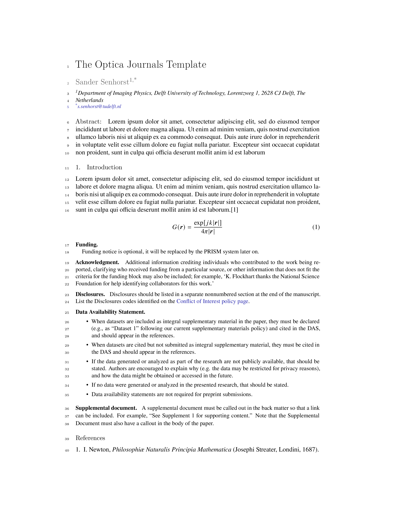

# Optica journals template

A template for the Optica (formerly OSA) publisher.

- Author: Sander Senhorst (TU Delft)



## Notes

- The Optica template requires a build using pdflatex to handle the fonts correctly, while MyST uses xelatex by default.
  This is currently fixed by forcing the use of pdflatex using xelatex2pdftex.sh and the latexmkrc file.
- MyST requires `natbib`, while the default template uses `cite`. I tried to handle the switch gracefully, but some
  residual edge cases may still appear.
- To follow the required numbering formats for equations, figures and tables, put the following lines in the frontmatter
  of your source file:
  
  ```yaml
  numbering:
    figure:
        template: Fig. %s
    table:
        template: Table %s
    equation:
        template: Eq. (%s)
  ```

- By default, if your bibliography entry has a url field, MyST will generate a note with the access date. To suppress
  this behavior, `opticajnl.bst` was edited so notes were disabled for all citation types except explict online sources.
